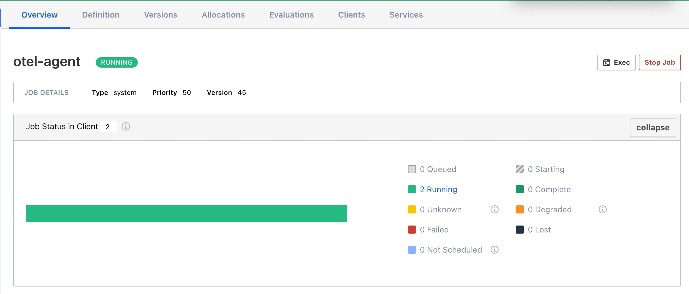
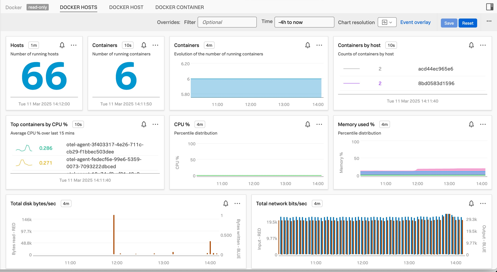

# 1. Install OTel Agent

## OTel Agent Job Download 하기

아래 Github 주소에서 nomad 용 에이전트 job 파일을 다운로드 받습니다.

[Splunk OpenTelemetry Collector for HashiCorp Nomad](https://github.com/signalfx/splunk-otel-collector/tree/main/deployments/nomad)

```bash
$ wget https://github.com/signalfx/splunk-otel-collector/blob/main/deployments/nomad/otel-agent.nomad
```

## Job Definition 수정하기

다운로드 받은 otel-agent.nomad 파일을 열어 아래 부분을 수정합니다

```bash
job "otel-agent" {
  datacenters = ["dc1"]
  type        = "system"

# Constraint 주석처리
#  constraint {
#    attribute = "${attr.nomad.version}"
#    operator  = "semver"
#    value     = "< 1.8.0"
#  }

    service {
      provider = "nomad" #모든 서비스에 해당 부분 추가
      name = "otel-agent"
      port = "health_check"
      tags = ["health"]


    service {
      provider = "nomad"  #모든 서비스에 해당 부분 추가
      name = "otel-agent"
      port = "otlp"
      tags = ["otlp"]
    }


    task "otel-agent" {


      env {
        SPLUNK_ACCESS_TOKEN = "<o11y_ingest_token>"
        SPLUNK_REALM = "<realm>"
        SPLUNK_MEMORY_TOTAL_MIB = 500
      }
    }

```

# 2. Collect Docker container metrics

일단 위 단계에서 수정 한 파일을 가지고 otel agent job을 배포 해 보면 에이전트가 각 클라이언트 서버에 잘 배포 되는 것을 확인 할 수 있습니다.

```bash
$ nomad job run otel-agent.nomad

==> 2025-03-11T09:43:16+09:00: Monitoring evaluation "0ccecfc9"
    2025-03-11T09:43:16+09:00: Evaluation triggered by job "otel-agent"
    2025-03-11T09:43:18+09:00: Allocation "38bc5e89" created: node "c55ca068", group "otel-agent"
    2025-03-11T09:43:18+09:00: Allocation "e0ace9ab" created: node "85b7e6e9", group "otel-agent"
    2025-03-11T09:43:18+09:00: Evaluation status changed: "pending" -> "complete"
==> 2025-03-11T09:43:18+09:00: Evaluation "0ccecfc9" finished with status "complete"
```

그러나 이 상태에서는 에이전트만 배포되고, 컨테이너에서 발생하는 메트릭을 signalfx로 보내지 못하는 상태입니다. docker receiver 를 설정하여 메트릭을 스크래핑 후 o11y cloud로 보내도록 설정 해주어야 합니다

## Client Server 에서 nomad 설정 수정

클라이언트 서버에 콘솔로 접근 후, nomad 설정파일을 엽니다

```bash
$ cd /etc/nomad.d/
$ sudo vi nomad.hcl
```

설정 파일에 아래와 같은 형식으로 볼륨 마운트 설정을 넣어줍니다

```bash
# nomad.hcl

data_dir  = "/opt/nomad"
bind_addr = "0.0.0.0"

client {
  host_volume "dockersock" {
    path      = "/var/run/docker.sock"
    read_only = true
  }
}
```

## otel-agent.nomad 파일 수정

에이전트 설정 파일에 아래와 같이 내용을 추가합니다

```bash
# otel-agent.nomad

job "otel-agent" {


  group "otel-agent" {
    volume "vol" {
      type      = "host"
      read_only = true
      source    = "dockersock"
    }


    task "otel-agent" {
      driver = "docker"

      volume_mount {
        volume      = "vol"
        destination = "/var/run/docker.sock"
        read_only   = true
      }


receivers:
  smartagent/docker-container-stats:
    type: docker-container-stats


service:
  pipelines:
    metrics:
      exporters:
      - debug
      - signalfx
      processors:
      - memory_limiter
      - batch
      - resourcedetection
      receivers:
      - hostmetrics
      - signalfx
      - smartagent/docker-container-stats

```

## 에이전트 재배포 후 수집 확인

otel-agent.nomad 파일로 잡을 다시 구동시켜 새로운 설정이 에이전트에 반영 되도록 합니다.

```bash
$ nomad job run otel-agent.nomad

==> 2025-03-11T09:45:30+09:00: Monitoring evaluation "033c1e2e"
    2025-03-11T09:45:30+09:00: Evaluation triggered by job "otel-agent"
    2025-03-11T09:45:30+09:00: Allocation "fedecf6e" created: node "85b7e6e9", group "otel-agent"
    2025-03-11T09:45:30+09:00: Allocation "3f403317" created: node "c55ca068", group "otel-agent"
    2025-03-11T09:45:30+09:00: Evaluation status changed: "pending" -> "complete"
==> 2025-03-11T09:45:30+09:00: Evaluation "033c1e2e" finished with status "complete"
```

Nomad UI 페이지로 가서 job이 제대로 구동되고 있는지 확인합니다.


Splunk Observability Cloud 로 가서 컨테이너 메트릭이 유입되고 있는지 확인합니다.


# 3. Collect Nomad metrics

## Client Server 에서 prometheus 메트릭 설정하기

## otel-agent.nomad 에서 receiver 설정하기

## 에이전트 재배포 후 수집 확인

# 4. APM Instrumentation
